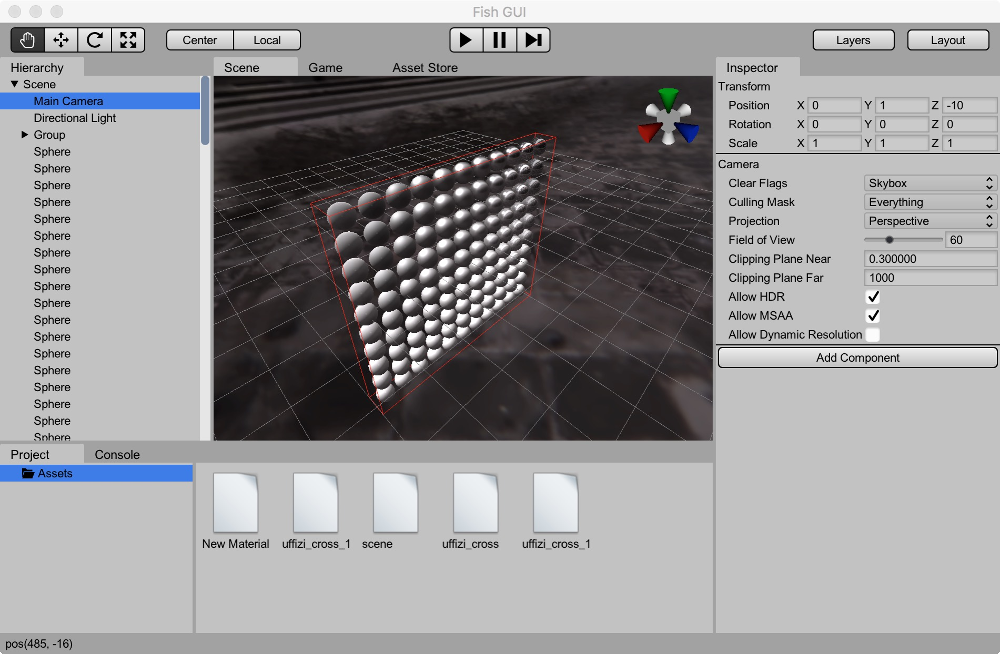
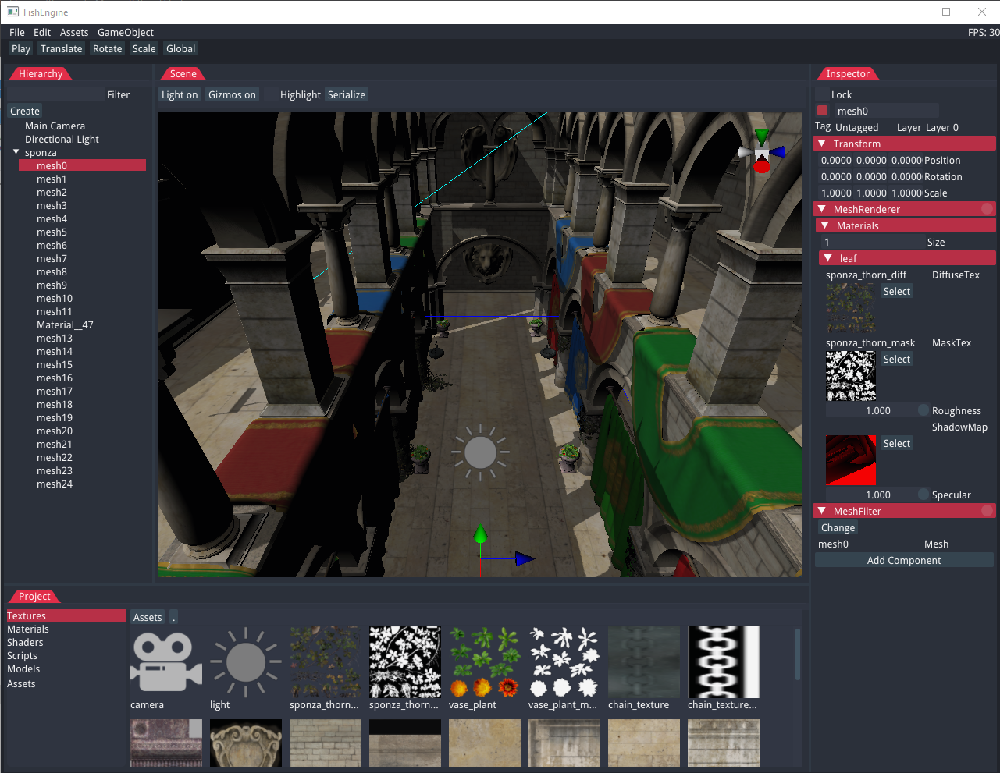
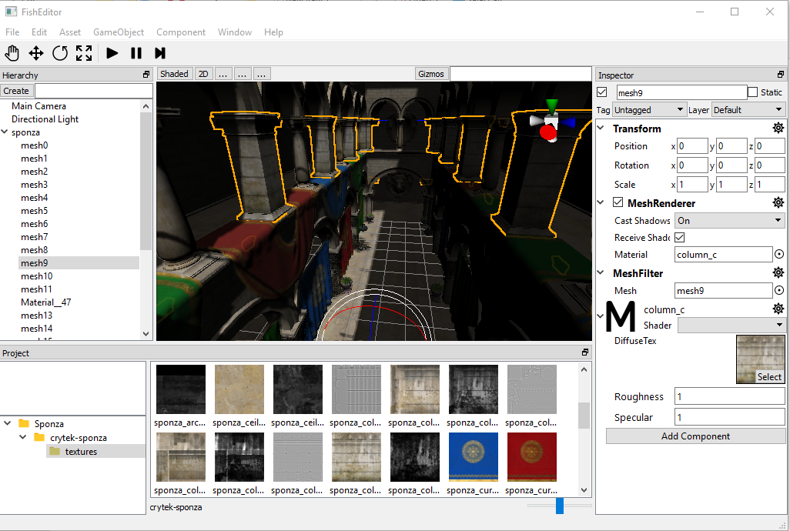

# FishEngine

## What is FishEngine

FishEngine is a simple, Unity-like game engine, mainly written in C++14.

new GUI([FishGUI](https://github.com/yushroom/FishGUI))




old GUI(imgui)




old GUI(Qt)




## Features

- Unity-like Editor
- Nearly same API with Unity
- Physically Based Rendering (PBR)
- Deferred Rendering
- Asset management (WIP)
- Physics system (WIP)
- Audio(WIP)
- Editor with immediate mode GUI(IMGUI)


## How to Build

- [macOS](https://github.com/yushroom/FishEngine/blob/master/Doc/install_osx.md)
- windows[WIP]

---

Before your build, you will need to have some additional software installed:

- [Git](http://git-scm.com/downloads).
- [CMake](https://cmake.org/download/). Version 3.0.0 or later is required.
- [Python](https://www.python.org/downloads/). Version 2.7.x is required, 3.x is not officially supported because libclang has no python3 binding.
- [Visual Studio 2015](https://www.visualstudio.com/downloads), Update 3 (Windows only)


---

**for all platforms:**

- Download and install PhysX SDK from [here](https://developer.nvidia.com/physx-sdk). You may get source on GitHub and compile by yourself. Current version is 3.4.1.
- Download and install Autodesk FBX SDK from [here](http://usa.autodesk.com/adsk/servlet/pc/item?siteID=123112&id=26416130). Current version is 2018.1.1.

**for windows:**

- download and install [Clang](http://releases.llvm.org/3.9.1/LLVM-3.9.1-win64.exe), clang is required if you want to automatically generate reflection code.

---

**Step 1.** Clone the sources and create a build directory.

```shell
git clone https://github.com/yushroom/FishEngine.git
cd FishEngine/Engine
mkdir build && cd build
```
**Step 2.** Use CMake to generate project file using any [desired generator](https://cmake.org/cmake/help/v3.0/manual/cmake-generators.7.html). Replace **PhysX_ROOT_DIR** and **FBXSDK_DIR** with yours. Or you can use camke-gui to do the same thing(recommended).

```shell
cmake -G "Visual Studio 14 Win64" -DPhysX_ROOT_DIR=D:\program\PhysX-3.3\PhysXSDK -DFBXSDK_DIR="D:\Library\FBX SDK\2017.1" ..
```

**Step 3.** Finally, you can use any IDE according to you selected generator, but you can also just build straight from CMake. Build results can be found in Engine/Binary.

```shell
cmake --build . --target FishEditor --config Release
```


## 3rd Party Libraries

**for all platforms:**

- [boost](http://www.boost.org/) (filesystem)
- [Autodesk FBX SDK](http://www.autodesk.com/products/fbx/overview) (.fbx model importer)
- [gli](https://github.com/g-truc/gli) (dds texture loader) and [glm](https://github.com/g-truc/glm) (required by gli)
- [freeimage](http://freeimage.sourceforge.net/) (image loader)
- [yaml-cpp](https://github.com/jbeder/yaml-cpp) (serialization)
- [PhysX](https://developer.nvidia.com/physx-sdk) (physics system)
- [glfw](https://github.com/glfw/glfw)(window and input)
- [FMOD](http://www.fmod.org/download/)(audio)


**for MS Windows:**

- [clang](http://www.boost.org/) (c++ reflection)
- [glew](https://github.com/nigels-com/glew) (opengl loader)

